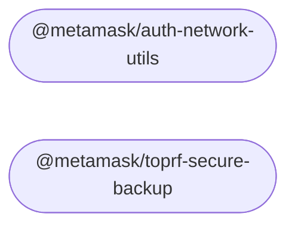

# `toprf-sdk`

This monorepo is ...

## Contributing

See the [Contributor Guide](./docs/contributing.md) for help on:

- Setting up your development environment
- Working with the monorepo
- Testing changes in clients
- Issuing new releases
- Creating a new package

## Installation/Usage

Each package in this repository has its own README where you can find installation and usage instructions. See `packages/` for more.

## Packages

<!-- start package list -->

- [`@metamask/auth-network-utils`](packages/auth-network-utils)
- [`@metamask/toprf-secure-backup`](packages/toprf-secure-backup)

<!-- end package list -->

<!-- start dependency graph -->

<!-- end dependency graph -->

(This section may be regenerated at any time by running `yarn update-readme-content`.)
