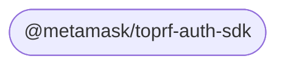

# Toprf Auth Sdk

Toprf Auth Sdk

## Template Instructions

Follow these instructions when using this template.

Find and replace all instances of "Toprf Auth Sdk" with the correct casing as follows:

- `Toprf Auth Sdk` (Title Case)
- `Toprf Auth Sdk` (lowercase)
- `toprf-auth-sdk` (kebab-case)
- `TOPRF_AUTH_SDK` (SNAKE_CASE)

## Modules

This repository contains the following packages [^fn1]:

<!-- start package list -->

- [`@metamask/toprf-auth-sdk`](packages/toprf-auth-sdk)

<!-- end package list -->

Or, in graph form [^fn1]:

<!-- start dependency graph -->

<!-- end dependency graph -->

Refer to individual packages for usage instructions.

## Learn more

For instructions on performing common development-related tasks, see [contributing to the monorepo](./docs/contributing.md).

[^fn1]: The package list and dependency graph should be programmatically generated by running `yarn update-readme-content`.
